# Windows C++ Environment Setup

## Step 1: Download and Extract Archives
Go to the [release page](https://github.com/SchrodingerZhu/cuhksz-qt/releases/tag/0.2-beta) on Github, download `qt.zip` and extract it to the place you like (we will use `c:/qt` for example).

>  You can install [7-zip](https://www.7-zip.org) to extract the archive as it is much faster than the default zip embedded in Windows .

**TODO: Add mirror**

## Step 2: Setup Environment Variables

Open File Explorer and right click on `This PC`.

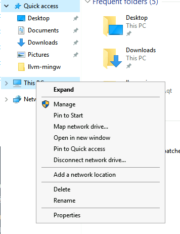

Click `Properties` and click `Advanced system settings` on the upper left coner:

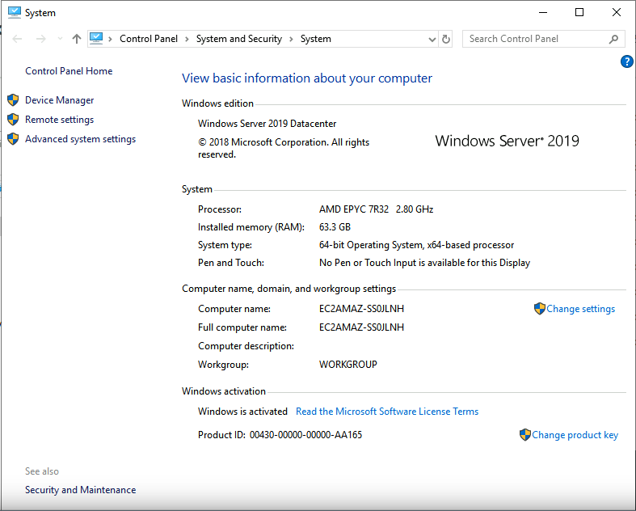

In tab `Advanced`, you can see the `Environment Variables` button, click it.

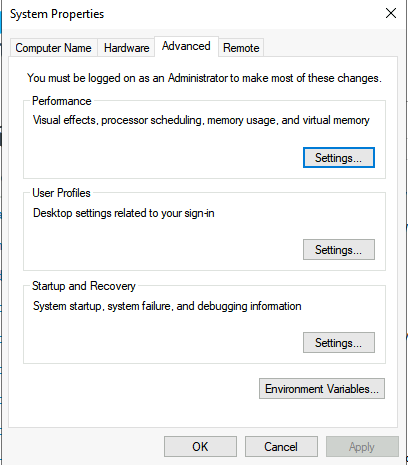

Then, there is a `Path` Variable,

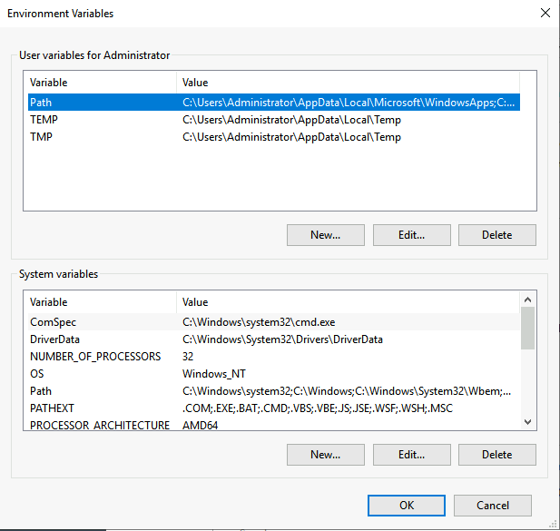

Choose it and then click `Edit...`

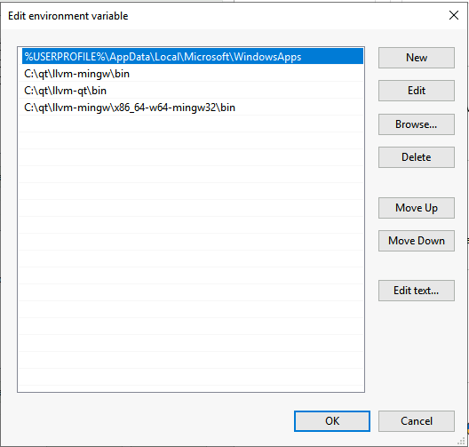

Click new to insert 3 new records:

(If you extract the archive in a difference place, please the above settings to the correct path).

## Step 3: Download and Install Qt Creator

You can go the a mirror like TUNA Mirrors or USTC Mirrors to get the installer. For example, the download link from tuna is:

https://mirrors.tuna.tsinghua.edu.cn/qt/official_releases/qtcreator/4.13/4.13.0/qt-creator-opensource-windows-x86_64-4.13.0.exe

Then, just follow the steps of the installer to finish the installation.

## Step 4: Setup Qt Kits

Open Qt Creator, and click `Tools>Options`

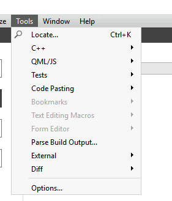

Go to `Kits>Compilers`:

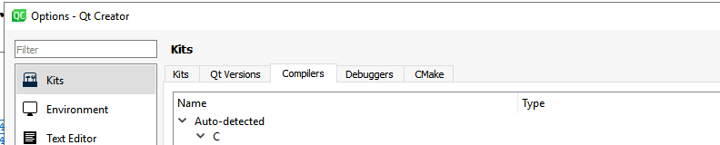

And then click, `Add>MinGW`:

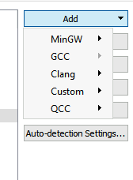

First add a C compiler:

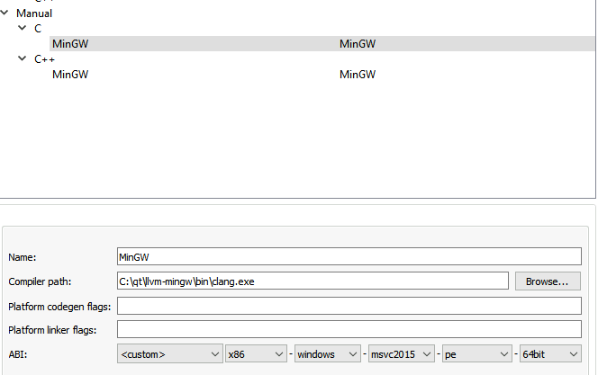

In `Compiler path`, locate to `<extracted path>\qt\llvm-mingw\bin\clang.exe`. 

In `ABI`, change it to `<custom>-x86-windows-msvc2015-pe-64bit`.

Then add a C++ compiler, following the exact same steps but change `clang.exe` to `clang++.exe`

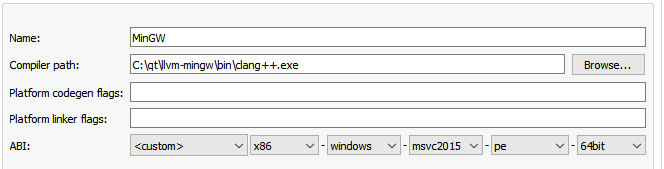

Then proceed to `Qt Versions`, click `Add...` and locate to `<extracted path>\qt\llvm-qt\bin\qmake.exe`

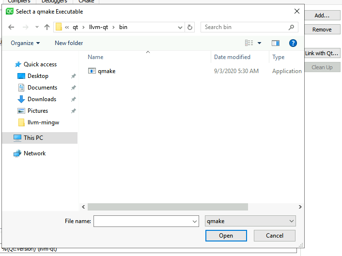

Then proceeds to `Kits`. Add a new kit (or edit the default kit) as the following:

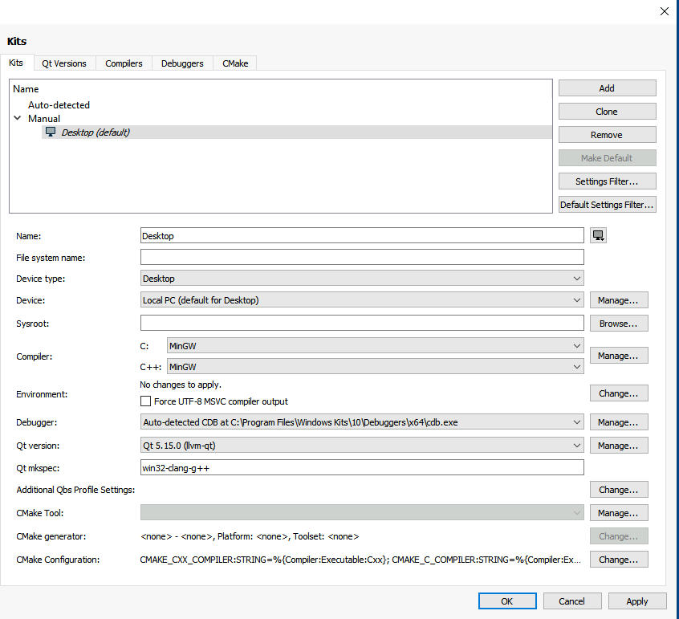

(Optional: You can also change the `Debugger` to `LLDB` is you like).

## Special Notes

### Windows Defender

Windows Defender is known to bring performance issue for C++ compilation. Basically, it scans all the intermediate files generated by the toolchains which slows down the whole process. If you experiences a very slow speed, you should probably consider disable Windows Defender (notice that Windows Defender may restart on its own if you simply shut it down using the Windows System Settings; you will need to search on your own for a reasonable way to disable it).

### What is the differences between CUHKSZ-Qt and Default Qt Distribution

- We only keep the core features of Qt that is useful for teaching purposes. Most extra tools like`QtWebengine` are removed from our build.
- We do not use standard MinGW environment. Default `MinGW-w64` lacks of some important features like sanitizers and it does have tons of bugs. Therefore, we use `llvm-mingw` to gain a better performance and more useful features. This brings some differences:
  - `Qt MkSpec` changes to `win32-clang-g++`
  - MinGW C Runtime is now `ucrt` (universal C runtime by Microsoft). Therefore, the platform triple is `x86-windows-msvc2015-pe-64bit`
  - The compiler is now clang
  - The linker is now `lld` (which is faster and less buggy but some unusual features of GNU LD are not supported)

